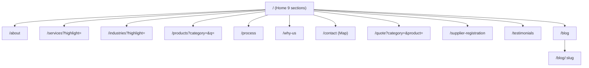
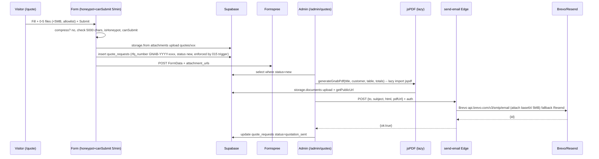
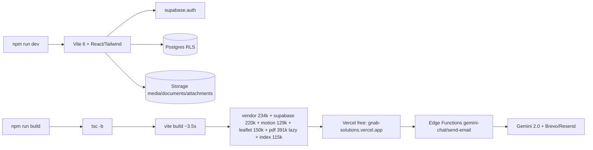
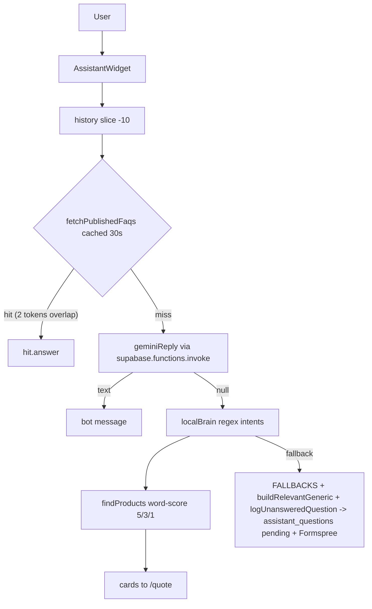

# GNAB Solutions — Complete Build Roadmap

> **One document to rebuild the entire platform without missing a function, feature, or pixel.**
> Stack: **React 19 + TypeScript 6 + Vite 6 + Tailwind 4 + Supabase (Auth/Postgres/Storage/Edge) + Framer Motion + Leaflet + jsPDF**
> Repo: `gnab-solutions` — private, `type: module` — `0.0.0`
> Last verified: **2026-10-07** — `vite build ~2.7s` `2.5M dist` `tsc -b` 0 `oxlint` 0 warnings `vitest` 101/101 — **35** content routes `200` (13 public + 22 admin incl. `/admin/pages`, `/admin/receipts`, `/admin/pdf-templates`; + `/admin/login`, `/admin/reset-password`, 404, `/admin` redirect = 39 `<Route>` total), 11 catalogues (132 items), migrations `001→038`
> **Latest:** Agro & Foodstuffs 11th catalogue (`038`: yam/maize/cocoa/fruits/vegetables as intermediary, Ghana + worldwide delivery, end-to-end in Home/Services/Products/Quote/Supplier/Assistant/Footer + quote regression tests) + Downloads auto-activate fix (upload auto-publishes when none active, active-delete promotes newest — footer never stuck on “being updated”) + footer fallback links include Agro. Before that: Payment options + account details on templates (How-to-Pay section), receipt mode + reference display, package reseeds with real GHS (retainer care, ERP scope) — `037`. Before that: assistant intelligence pass — IT Solutions intent (websites/ERP/SEO/hosting with scoping→proposal→training path), quote-validity/payment, bulk + standing orders, blog, after-sales, custom-sourcing chip, dismissive guard (no more junk in the unanswered queue), plural + phrase-bonus product search, system prompt with all 10 catalogues + /blog + no-invention rule. Before that: 10th catalogue **IT Solutions & Digital Services** (`034`); 9th catalogue **Automobile** (`032`/`033` + slug unification); **footer per-item toggles**; **mobile full-screen sheet**.

---

## Table of Contents
1. [Executive Summary](#executive-summary)
2. [Product Requirements Document (PRD)](#product-requirements-document-prd)
3. [Tech Stack & Tooling](#tech-stack--tooling)
4. [Architecture](#architecture)
5. [Folder Structure](#folder-structure)
6. [Database Schema & Migrations](#database-schema--migrations)
7. [Features — Public Site](#features--public-site)
8. [Features — Admin Portal](#features--admin-portal)
9. [UI/UX Design System](#uiux-design-system)
10. [Security](#security)
11. [Performance & SEO](#performance--seo)
12. [Environment & Secrets](#environment--secrets)
13. [Deployment — Free Publishing](#deployment--free-publishing)
14. [Storage & Anti-Flood](#storage--anti-flood)
15. [Operational Runbook](#operational-runbook)
16. [Replication Checklist — Step-by-Step](#replication-checklist--step-by-step)
17. [Future Roadmap](#future-roadmap)
18. [Appendix — Diagrams & Charts](#appendix--diagrams--charts)

---

## Executive Summary

**GNAB Business Solutions** — *"One Partner. Endless Solutions."* — is a corporate procurement platform for Ghana and West Africa. One call to GNAB replaces 100+ suppliers.

**Public promise:** *Simplify procurement through reliable sourcing, competitive pricing and timely delivery — across Ghana and beyond.* One quote, one delivery, one after-sales owner.

**Platform:** Marketing site (Home + 12 public pages) + full admin (**22 pages** incl. Home, Site Pages + Design, Footer + headings + per-item toggles, Storage Manager (files + trash), Receipts, PDF Templates) + AI assistant (Gemini) + maps (Leaflet lazy + OSRM) + PDF quotations/receipts/message replies (jsPDF lazy) + storage (attachments/media/documents).

**Catalogues (11, 132 items):** Office Stationery, IT Equipment, Cleaning & Janitorial, PPE & Safety, Office Furniture, Printing & Branding, Electrical Materials, Automobile Services & Spares, IT Solutions & Digital Services, **Agro & Foodstuffs** (farm produce sourced as intermediary — yam, maize, cocoa, rice, vegetables, fruits — delivered Ghana + worldwide), Custom Sourcing.

**Build guarantee:** Follow this doc in order — migrations `001→038`, `npm ci`, `.env` + edge secrets — and you get pixel-identical public + admin, with no missing honeypot, rate-limit, or cron. Header top bar (3-way toggle) and Footer (4-col + quick-links objects with per-item visibility + managed contact items) are fully mirrored from `site_settings`. Catalogue routing is slug-unified: any DB title/slug variant resolves to its canonical static slug, so new categories (e.g. Automobile) can never land on the wrong catalogue.

---

## Product Requirements Document (PRD)

### 1. Vision
Become Ghana’s most trusted procurement and supply partner — the single point of contact for sourcing, purchasing and delivering quality products.

### 2. Mission
Simplify procurement through reliable sourcing, competitive pricing and timely delivery.

### 3. Target Personas

| Persona | Example | Need |
|---|---|---|
| **Ama — Procurement Director** | Financial institution, Accra | One consolidated quote for 50 line-items, audit-ready, 24h turnaround |
| **Kwame — Operations Manager** | Hospital network, Kumasi | Monthly consumables on standing order, never stock-out, hygiene certified |
| **Sara — Admin Lead** | International NGO | Donor-compliant documentation, multi-region delivery, transparent pricing |
| **Yusuf — SME Owner** | Construction SME, Tema | Small quantity, fair price, no MOQ penalty, phone/WhatsApp ordering |

### 4. User Stories (selected)

**Public — Must have:**
- As a visitor, I can request a quote `(/quote?category=&product=)` with files and get a 24h reply promise — so I don’t chase.
- As a visitor, I can browse `Services` (11 cats) → `Products` (132 items) with search chips and request quote per item — picking an agro product filters the agro catalogue (never stationery) and pre-selects `Agro & Foodstuffs` in the quote form.
- As a buyer anywhere in the world, I can request bulk yam, maize, cocoa, fruits or vegetables via `/quote?category=agro-foodstuffs` — GNAB sources from vetted farmers, quality-checks, and delivers to Ghana or abroad as my intermediary.
- As a visitor on `/contact`, I see all company locations on one Leaflet map and get a free OSRM driving route from my location to any pin.
- As a visitor, I can leave a `Review` (20–2000 chars, 1–5 stars) — it appears after admin approval.
- As a visitor on a phone browser, I can open the nav menu from anywhere (even the footer) and always see the logo bar + close option — the menu is a full-screen sheet with its own top bar.
- As a visitor, I see footer Quick Links (incl. Reviews and Become a Supplier) and Contact lines exactly as the admin toggled/ordered them.
- As a visitor, I can ask the floating `GNAB Assistant` about products, pricing, delivery — it answers from FAQ → Gemini → local brain, and logs unanswered questions. It knows all 10 catalogues incl. Automobile + IT Solutions.

**Admin — Must have:**
- As an admin, I can toggle each footer Quick Link Shown/Hidden (incl. Reviews, Become a Supplier), reorder them, and manage unlimited Contact items (email/phone/WhatsApp/address/hours/link/text) each with its own toggle and order — the public footer mirrors all of it.

**Admin — Must have:**
- As an admin, I can edit **every** Home section (hero, trust bar, about, services preview, industries, why, process, stats, CTA, testimonial) without code — changes live instantly.
- As an admin, I can moderate testimonials (pending → approved/rejected 30d grace), answer assistant questions, and publish FAQs.
- As an admin, I can run the RFQ pipeline (`new → under_review → quotation_prepared → quotation_sent → awaiting_customer → won/lost/closed`) and generate a gold-navy PDF and email it via Brevo/Resend.
- As an admin, I can delete files in `Admin → Storage Manager` to free Supabase Storage, and I can see every soft-deleted item anywhere in admin with days-left and permanently purge it before the 30-day reconsideration ends.

### 5. Functional Requirements

**Public (13 routes):**
- `/` Home — 9 sections (hero crossfade 5s, trust 5, about, services 10+1 incl. Automobile + IT Solutions + Agro & Foodstuffs, industries 8, why 6, process 6, stats 4, testimonials carousel 6s, CTA)
- `/about`, `/services`, `/industries`, `/products`, `/process`, `/why-us`, `/contact`, `/quote`, `/supplier-registration`, `/testimonials`, `/blog`, `/blog/:slug`
- Floating WhatsApp `wa.me` (from `site_settings.whatsapp`), AssistantWidget (hidden on `/admin`), Back-to-top, 404.

**Admin (22 routes):**
- `/admin/login` (+ bootstrap `claim_first_admin` when `admin_users` empty), `/admin/reset-password`, `/admin/dashboard` (8 stats + storage bar + recent receipts + header/footer quick links), `/admin/home` (9 tabs), `/admin/footer` (4-col mirror + quick-links objects with per-item toggles + managed contact items + services `In footer`), `/admin/uploads` (recursive `walk('')` + pagination 1000, bulk delete + DB cleanup), `/admin/quotes` (RFQ pipeline + PDF via template + **Issue Receipt** when `won`), `/admin/receipts` (**NEW** — issue after won, `RCPT-YYYY-XXXX`, items/totals/balance, email via `send-email`), `/admin/pdf-templates` (5 tabs `quotation/website_package/erp_discovery/message_reply/receipt` with live header preview, `interpolate {{variables}}`, package standard items), `/admin/messages` (PDF via template), `/admin/suppliers`, `/admin/products` (+ categories), `/admin/services` (`show_in_footer` gold), `/admin/industries`, `/admin/why-us`, `/admin/process`, `/admin/media`, `/admin/locations`, `/admin/assistant`, `/admin/blog`, `/admin/testimonials`, `/admin/downloads`, `/admin/settings` (Header Display: `header_show_top_bar/phone/email/tagline`).

### 6. Non-Functional Requirements

| Area | Target | How |
|---|---|---|
| **Performance** | LCP <2.5s on 3G Ghana | `utils.imgSrcSet` 400/800/1200/1600 `&fm=webp`, `fetchPriority high` hero, lazy `leaflet` (`import('leaflet')` + `leaflet.css` static) / `jspdf` (`await import('jspdf')` in `pdf.ts:34`), `modulePreload false`, `ImageUploader` 1280w webp 0.72 compress, `sitemap.xml` 11 static urls (excludes `/supplier-registration` + dynamic slug by design) + `robots.txt` |
| **Security** | No open relay, no privilege escalation, no storage flood | `015` RLS `with check (status=new ...)`, honeypot `website_hp`, `canSubmit 5/min`, `020` DB guards (`message<=5000`, `attachments<=5`), `021` storage trigger 5MB, edge CORS + auth |
| **Reliability** | No empty page | Every `fetch*` has fallback `CATALOGUE`/`DEFAULT_TESTIMONIALS` + `FALLBACK_*` |
| **Accessibility** | WCAG AA | `Field` `htmlFor`/`id` via `cloneElement`, `16px` inputs on mobile, `focus-visible:ring`, `aria-label` on map/dots |
| **SEO** | All public pages indexable | `setPageMeta` per route (13 pages — every public route), `setOrganizationJsonLd` on Home, `sitemap.xml` + `robots.txt` in `public/` |
| **Maintainability** | `tsc -b` 0, `oxlint` 0 warnings, `vitest` 101/101 | `strict` + `noUncheckedIndexedAccess` on, `supabase gen types` checked in (`src/types/supabase.ts`), `formStr` + `void` hygiene enforced by `no-base-to-string`/`no-floating-promises` |

---

## Tech Stack & Tooling

| Layer | Choice | Why | Version |
|---|---|---|---|
| App | React 19 + React Router 7 | SPA with `BrowserRouter`, lazy `13+22` routes, `Suspense` | `19.2.8` / `7.18.2` |
| Build | Vite 6 + `@vitejs/plugin-react` | `rolldown` stable after `8` breakage, `alias @ → ./src` | `6.4.1` / `4.3.3` |
| Style | Tailwind 4 + `@tailwindcss/vite` | `@theme` vars, `glass` blur, `text-gradient-gold` | `4.3.3` |
| Auth/DB/Storage/Edge | Supabase JS 2 | `anon_key` client, `is_admin()` RLS, 3 buckets `media/documents/attachments` | `2.112.3` |
| Motion | Framer Motion 13 | `Reveal`, `stagger`, `Counter` 1600ms, `AnimatePresence` | `13.1.1` |
| Map | Leaflet 1.9 + OSRM `router.project-osrm.org` | Free, no key, `tile.openstreetmap.org`, driving `overview=full&geometries=geojson` | `1.9.4` |
| PDF | jsPDF 4 | `generateGnabPdf` navy `#0B2E59` gold `#D4AF37` A4 | `4.2.1` |
| Icons | lucide-react 1 + `ICON_OPTIONS` 40+ | `Building2…ArrowRight`, `ICON_MAP` | `1.33.0` |
| Email | Brevo (pref) + Resend fallback via `send-email` edge | `api.brevo.com/v3/smtp/email` → `api.resend.com/emails` | — |
| LLM | Gemini 2.0-flash → 1.5-flash fallback via `gemini-chat` | `temperature 0.4 max 1024` | — |
| Form delivery | Formspree | `VITE_FORMSPREE_ENDPOINT` POST `FormData` + `Accept: application/json` | — |

**Scripts:** `dev: vite`, `build: tsc -b && vite build` (~2.7s, 2.5M), `lint: oxlint` (0 warnings), `preview: vite preview`, `test: vitest` (101 tests: env/routing/honeypot/`formStr`/`canSubmit`/`imgSrcSet`/`getPublicUrl`/pdf `interpolate`+RFQ-RCPT/package-template routing+payment lines/assistant intents+product search+agro intent/quote guards + IT quote helpers + agro dropdown/slug resolution/design `slugify`+`splitHighlight`+themes/CTA features `030`/admin search pages+`sanitizeLike`/trash `daysLeft`+`extractStorageRef`+purge/restore), `test:e2e: playwright test` (read-only smoke tests, run in CI against preview build).

---

## Architecture

### High-Level — Request Flow

```mermaid
graph TD
    Visitor-- "GET /"|-->|Vite SPA| App[App.tsx BrowserRouter]
    App -->|lazy| Home[HomePage.tsx]
    Home -->|fetch| Supabase[(Supabase Postgres)]
    Home -->|fetch| Storage[(Storage: media/attachments)]
    Visitor-- "POST /contact"|--> Contact[ContactPage.tsx]
    Contact -->|Formspree + supabase.from contact_messages| Supabase
    Contact -->|upload| Storage
    Contact -->|leaflet| OSM[OpenStreetMap Tiles]
    Contact -->|OSRM| Router[router.project-osrm.org]
    Admin-- "/admin/*"|--> ProtectedRoute
    ProtectedRoute -->|supabase.auth.getSession + is_admin| Supabase
    ProtectedRoute -->|admin_all_* RLS| Supabase
    Admin -- "Generate PDF" --> PDF[lib/pdf.ts jsPDF]
    PDF -->|upload| Storage
    Admin -- "Send email" --> Edge[send-email Edge Function]
    Edge --> Brevo[Brevo API]
    Brevo -. fallback .-> Resend
    Visitor -- "Chat" --> Widget[AssistantWidget.tsx]
    Widget -->|FAQ -> LLM -> local| Edge2[gemini-chat Edge]
    Edge2 --> Gemini[Google Gemini]
```

### Folder Structure (actual `src/`)

```
src/
  App.tsx                # Router, lazy 13+22, PublicLayout (Header/Footer/FloatingWhatsApp), NotFound, useAutoHideScrollbar
  main.tsx               # createRoot(<App/>)
  index.css              # @import tailwindcss; @theme navy/gold/mist; glass; card-hover; leaflet z-index 1/400; 16px mobile
  assets/hero.png, react.svg
  lib/
    supabase.ts          # createClient(VITE_SUPABASE_URL/ANON_KEY), getPublicUrl(bucket,path)
    utils.ts             # cn, requireEnv, CONTACT, COMPANY, IMAGES (15 unsplash), imgSrcSet, NAV_LINKS 10, PRODUCT_CATEGORIES 10, INDUSTRIES_LIST 8, canSubmit/recordSubmit 5/min, isHoneypotFilled + formStr(fd,key) safe getter (File-proof, kills no-base-to-string), ALLOWED_ATTACHMENT_TYPES/EXTS + isAllowedAttachment, RATE_KEY_PREFIX
    siteData.tsx         # SiteSettings (header_show_* 4 + footer_show_* 6 + footer_quick_links objects + footer_contact_items + 20 design keys: home_hero_*/page_hero_*/cta_* + 6 *_cta_title_highlight + footer_*_title/heading_style) + DEFAULT_SETTINGS (11 default quick links incl. Reviews/Contact/Supplier, 3 seed contact items) + Provider/useSiteSettings + ALL_FOOTER_LINK_DEFS 11 + parseFooterQuickLinks (legacy string[] + object[] + visible) + parseFooterContactItems (7 kinds + visible) + fetchPublicProducts/Services (and fetchFooterServices 20) /Industries/Why/Process + SiteImage/SITE_IMAGE_SECTIONS 12 + fetchSiteImages + BlogPost + HomeHero/Trust/About/Stat/Cta + fetchHome* + fetchActiveCompanyProfile + setPageMeta/setJsonLd/setOrganizationJsonLd + fetchPdfTemplate
    design.ts            # Heading design system: EYEBROW_STYLES pill/minimal/tag, TITLE_SIZES compact/standard/grand, CTA_THEMES navy-gold/emerald/midnight, FOOTER_HEADING_STYLES classic/gold-bar/gold-highlight, HERO_ALIGNS, slugify (shared Services/Industries/Home), splitHighlight (gold-tail like Home Your Procurement?), titleSizeClass, ctaThemeClass, DESIGN_LABELS
    testimonials.ts      # DEFAULT_TESTIMONIALS 3, fetchApprovedTestimonials, submitTestimonial (pending + Formspree, honeypot website_hp, 20-2000 chars)
    catalogue.ts         # CATALOGUE 10x12 =120 (incl. automobile-services + it-solutions-digital-services), catalogueBySlug, TOTAL_PRODUCTS + slug unification: slugifyCategory, canonicalCatalogueSlug (DB variant → static slug via exact/substring/token-overlap), catalogueTitleForSlug (slug → exact dropdown title), SERVICE_CATEGORY_OPTIONS (single source for admin dropdowns)
    iconOptions.ts       # ICON_OPTIONS 40+, ICON_MAP, getIconByName
    assistant.ts         # ChatMessage, WELCOME_MESSAGE 3x, AssistantFaq cached 30s, logUnansweredQuestion (asked_count + Formspree), localBrain (regex intents, 10 catalogues incl. Automobile + IT Solutions), findProducts word-score 5/3/1, SYSTEM_PROMPT (10 catalogues), geminiReply (x-goog-api-key), getAssistantReply (FAQ→LLM→local + buildRelevantGeneric)
    pdf.ts               # PdfTemplate + interpolate + fetchPdfTemplate/fetchAllPdfTemplates + generateGnabPdf (jsPDF A4, template-aware primary/accent/header/footer, lazy import jspdf), uploadPdfAndGetUrl (documents)
  components/
    ErrorBoundary.tsx    # class, 60vh Oops
    layout/Header.tsx    # sticky z-[1000] isolate, top bar AnimatePresence height, respects header_show_top_bar + header_show_phone/email/tagline per-item (Header Display admin), rAF scroll >16, glass saturate 180% blur 18px + fallback, logo 48→36 hover scale, tagline always visible flex justify-between 7-8px gold, full nav xl 10 pill motion.layoutId, compact lg 6+More dropdown, CTA btn-shine sweep, hamburger Menu/X → mobile FULL-SCREEN sheet (own 64px logo + X bar, opaque, z-[70] above chat, role dialog aria-modal, staggered links, own scroll + safe-area, body lock, ESC) — sheet lives OUTSIDE the glass bar (glass backdrop-filter traps fixed descendants) and carries its own header (phone browsers can unstick the sticky bar while scroll is locked), so it opens identically from hero or footer
    layout/Footer.tsx    # navy-800 radial gold, 4-col grid [1.3fr_1fr_1fr_1.1fr]: Brand (logo white, company_description, tagline pill, Download PDF→fetchActiveCompanyProfile, footer_text) toggle footer_show_brand; Quick Links (parseFooterQuickLinks: legacy string[] + objects {name,path,visible}, per-item visibility, default 11 incl. Reviews/Contact/Supplier, FALLBACK 10 services) + Services (fetchFooterServices 20, no 6-limit, show_in_footer, footer_label/path) + Contact (managed footer_contact_items: email→mailto, phone→tel, whatsapp→chat, address/hours/text, link→new-tab, each with visible toggle + order; legacy email/phone/address fallback) — all three headings via shared FooterHeading (text footer_quick_links_title/services_title/contact_title + style footer_heading_style classic/gold-bar/gold-highlight, default gold-bar), bottom © + Lock + Back to top toggle footer_show_bottom
    admin/AdminLayout.tsx # sidebar 64 gradient navy **22 NAV** (Dashboard/Home/Site Pages/Footer/Uploads/Receipts/PDF Templates/Quotes/Messages/Suppliers/Products/Services/Industries/Why Us/Process/Media/Locations/Assistant/Blog/Testimonials/Downloads/Settings), layoutId gold bar, mobile drawer spring, topbar glass AdminSearch ⌘K + View Site + G, PageIntro
    admin/DesignControls.tsx # useSiteSetting(key) + DesignSelect + HomeHeroDesignCard/GlobalHeroDesignCard/CtaDesignCard/FooterHeadingDesignCard — every control upserts site_settings instantly, public mirrors on next load
    admin/AdminSearch.tsx    # ⌘K palette: ADMIN_PAGES index + filterAdminPages + sanitizeLike + live multi-table ilike searchRecords (quotes/receipts/messages/suppliers/products/services/industries/blog/testimonials/locations/assistant, limit 4 each) → ?q= deep-links; useQuerySearch() hook (list boxes honour ?q=, sync on nav, never clobbers typing)
    admin/ProtectedRoute.tsx # getSession + onAuthStateChange + admin_users + claim_first_admin, spinner, Navigate /admin/login, Access Denied
    admin/bits.tsx        # Badge, Drawer (overlay+spring right), EmptyState, ErrorBanner amber, Skeletons pulse, Pagination
    admin/ImageUploader.tsx # preview 24x32 dashed, URL input + Upload hidden file + Remove, compressImage 1280w webp 0.72 (if >300KB), upload media folder, getPublicUrl, 5MB guard, `ALLOWED_ATTACHMENT_TYPES` check
    chat/AssistantWidget.tsx # hidden on /admin, launcher scale0→1 ping ring Sparkles/X, tooltip, panel 390x600 dvh rounded 26, header gradient navy, RichText (**bold + [label](href) + bullets), Chips, cards grid, typing bounce, input + green Send, uses CONTACT.logo/whastappLink fallback
    ui/index.tsx          # Reveal (useInView once -80px), staggerParent/Child, SectionHeading, ButtonLink (primary/gold/outline + btn-shine sweep), Button (loading spinner), inputClass, Field (htmlFor/id via cloneElement from name), Eyebrow (pill/minimal/tag), PageHero (gradient navy 28py gold hairline + orbs, eyebrow style + align left/center + title size via page_hero_* settings, gold-highlight title), PremiumCTA (Home COT design: theme navy-gold/emerald/midnight outer/inner/orbs, Eyebrow style, titleHighlight gold-tail via splitHighlight, align, title size via cta_* settings, gold/outlineLight CTAs, feature strip), FooterHeading (classic/gold-bar/gold-highlight)
  pages/
    public/ HomePage (hero crossfade 5s `imgSrcSet`+`fetchPriority high` + design-driven eyebrow/size/align via home_hero_* + useSiteSettings, trust 5 from home_trust_items, about from home_about + site_images, services ALL published via canonicalCatalogueSlug → `/services?highlight=` (no slice cutoff, Automobile + Agro always present; fallback static 10+1 incl. Car + Code2 + Tractor icons), industries 8 with slug → `/industries?highlight=` (mirrors services), why 6, process 6, stats 4 from home_stats, testimonials 6s, CTA from home_cta + cta_* theme/eyebrow/size/align; all fetch with fallbacks + setPageMeta/setOrganizationJsonLd), AboutPage (setPageMeta + PremiumCTA titleHighlight), ServicesPage (DB vs catalogue conditional, `?highlight=`/`?service=` reorder + ring + Selected via matchSlug + canonicalCatalogueSlug, product links use canonical `(category||name)` slug + image fallback by canon slug, setPageMeta + PremiumCTA titleHighlight), IndustriesPage (`?highlight=`/`?industry=` reorder + ring + Selected — mirrors ServicesPage, setPageMeta + PremiumCTA titleHighlight), ProductsPage (sticky filter chips + search, setPageMeta; DB grouping fuzzy-merges title/slug variants to canonical slugs in CATALOGUE order, so automobile products never fall into stationery), ProcessPage (timeline gold rail, setPageMeta), WhyUsPage (alternating rows, setPageMeta), ContactPage (channels from useSiteSettings + form honeypot website_hp + canSubmit 5/min + isAllowedAttachment 5MB/5 files + ContactMap leaflet lazy dynamic import + OSRM), QuotePage (prefill via catalogueTitleForSlug against PRODUCT_CATEGORIES incl. Automobile + IT Solutions + sync-on-navigate + unknown-value option, IT-only fieldset scope/current/users/timeline via isITSolutionsCategory/formatITProjectDetails appended to the RFQ requirement text, honeypot, canSubmit, file caps, recordSubmit), SupplierRegistrationPage (honeypot website_hp fix, canSubmit 3/min, 11 pills incl. Automobile + IT Solutions + Agro & Foodstuffs), TestimonialsPage (honeypot, canSubmit 3/min, 20-2000 chars), BlogListPage (chips All+5 cats, setPageMeta), BlogPostPage (premium hero gradient + orbs, share, setPageMeta)
    admin/ DashboardPage (8 stats: quotes/messages/assistant/suppliers/testimonials/receipts/uploads/pdf_templates + storage bar + recent 5 RFQs + recent 3 receipts + quick actions Home/Footer/Receipts/PDF Templates + header/footer visibility), HomeAdminPage (9 tabs with fallback amber badges + inline Services/Industries/Why/Process editors + Hero/CTA heading-design cards), PagesAdminPage (11 content tabs + ✨ Design tab with HomeHero/GlobalHero/Cta design cards + per-page CTA highlight fields), FooterAdminPage (4-col mirror, column visibility toggles, Quick Links custom {name,path} JSON + Services In footer toggle no 6-limit + column heading text/style + FooterHeadingDesignCard), QuotesAdminPage (RFQ pipeline 8 statuses + PDF via template interpolate + Issue Receipt when won → /admin/receipts?rfq=), ReceiptsAdminPage (NEW: RCPT-YYYY-XXXX, link to won RFQ + sent quotation, items/totals/balance, payment method/date, PDF via receipt template + email via send-email), PdfTemplatesAdminPage (5 tabs quotation/website_package/erp_discovery/message_reply/receipt, live header preview, subject/title/subtitle/header colors/logo/table_head/totals/terms/footer + standard-items editor for package types), MessagesAdminPage (reply via message_reply template), SuppliersAdminPage, ProductsAdminPage (+categories), ServicesAdminPage (show_in_footer gold), IndustriesAdminPage, WhyUsAdminPage, ProcessAdminPage, MediaAdminPage (site_images 12 sections), LocationsAdminPage, AssistantAdminPage, BlogAdminPage, TestimonialsAdminPage, DownloadsAdminPage, SettingsAdminPage (Header Display: header_show_top_bar + per-item phone/email/tagline toggles + inputs), UploadsAdminPage = Storage Manager (Files tab: recursive walk all buckets + pagination 1000, bulk delete + DB cleanup; Trash tab: all 17 soft-delete tables with days-left, restore, purge-now incl. referenced files via lib/trash.ts)
  types/index.ts         # legacy interfaces (active in siteData)

supabase/
  migrations/001→038 (see Schema)
  functions/gemini-chat/index.ts, send-email/index.ts
public/
  sitemap.xml (11 static urls — excludes `/supplier-registration` + dynamic `/blog/:slug` by design), robots.txt, favicon.svg, icons.svg, og-image.svg
scripts/serve_spa.py     # SimpleHTTP SPA fallback
```

---

## Database Schema & Migrations

**Run in order `001`→`038` in Supabase Dashboard → SQL Editor.** Seed inserts are idempotent (`on conflict do nothing` / `where not exists`).

| Migration | Tables / Buckets | Notable Policies / Triggers |
|---|---|---|
| `001_testimonials` | `testimonials` (client_name, role, company, rating 1-5, quote, status pending/approved) | `public_submit_pending` insert pending only; `public_read_approved` select approved |
| `002_admin_access_control` | `admin_users` (user_id→auth.users) + `is_admin()` security definer | Fixes open admin: `public.is_admin()` + `revoke anon, grant authenticated` |
| `003_rejection_retention` | `testimonials.rejected_at` + `pg_cron 03:17 purge_rejected` | 30d grace for rejected |
| `004_business_tables` | `quote_requests` (rfq_number unique, status 8, assigned_to, internal_notes, full_name, company_name, email, phone, whatsapp, industry, product_category/item, other_category/product, products_or_services, quantity, delivery_location, message, attachment_urls text[5]) + `suppliers` (company_name, contact_person, email, phone, whatsapp, business_address, website, registration_number, tin_number, category, categories_supplied text[], products_services, years_in_business, areas_of_operation, description, additional_info, document_urls, attachment_urls, status pending/approved, internal_notes) | `public_submit_rfq with check (true)` → tightened in `015` to `status=new ...`, supplier `status='pending'` |
| `005_catalogue_content` | `product_categories` (name unique), `products` (name, category, short_description, description, image_url, featured, status active/inactive, display_order, seo), `services` (name, category, short_description, full_description, image_url, published, display_order), `blog_posts` (title, slug unique, excerpt, content, featured_image_url, author, category 5, tags text[], status, meta), `company_documents` (file_name, file_path unique, file_size, is_active), `site_settings` (key pk, value) seed 6 rows + 7 categories + buckets `media`+`documents` public, RLS `admins_*_storage` (`is_admin` on `media/documents`) | Catalogue CMS + blog + settings |
| `006_bootstrap_admin` | `claim_first_admin()` | First user can claim admin when `admin_users` empty |
| `007_full_cms_and_retention` | `industries` (name unique, description, icon Building2, display_order, published, deleted_at), `why_choose_us` (title, description, icon Handshake), `process_steps` (step_number, title, description, points text[], image_url) + `deleted_at` on 8 tables + indexes + seeds 8/6/6/8/96 + `pg_cron purge_soft_deleted_30d 03:22` for 11 tables | Full CMS + 30d soft-delete |
| `008_site_images_and_media` | `site_images` (section 12 enum, url, alt_text, sort_order, is_active, deleted_at), `why_choose_us.image_url` | Media library |
| `009_seed_site_images` | inserts 14 `site_images` | Home/about/services images |
| `010_industry_image_and_maps` | `industries.image_url`, `site_settings google_maps_*` | Industry photo + maps |
| `011_business_hours_and_assistant` | `site_settings hours_*` 3, `assistant_questions` (question, answer, status pending/answered/published/rejected, asked_count, answered_at, deleted_at) | Hours + Q&A pipeline, public insert pending |
| `012_business_locations` | `locations` (name, address, latitude, longitude, google_maps_url, is_primary, sort_order, is_active, deleted_at) seed Head Office | Multi-location map |
| `013_footer_beyond` | `site_settings.footer_text` update | — |
| `014_messages_quotations_attachments` | `contact_messages` (full_name, email, phone, subject, message, attachment_urls[5], status new/replied/closed, admin_reply, reply_pdf_url), `quotations` (quote_request_id→quote_requests, quotation_number unique, customer_name, company_name, email, items jsonb[], subtotal/discount/tax/total, valid_until, terms, notes, status, pdf_url) + `attachments` bucket public, `public_upload_attachments` anon+auth, `public_read_attachments`, `admin_delete_attachments` (`is_admin`) + adds `attachment_urls` to 3 tables + purge extended | Contact + quotations + attachments (5×5MB) |
| `015_harden_public_policies` | `enforce_quote_request_public/contact_message_public/supplier_public()` triggers + email regex constraints 3 + tight RLS `with check (status=new ... assigned_to null)` | Security: force safe defaults, 5-attachment cap |
| `016_home_cms` | `home_hero` (badge, title_prefix/highlight/suffix, subtitle, primary/secondary label/link), `home_trust_items` (icon, label, display_order), `home_about` (eyebrow, title, paragraph1/2, badge, phone, primary, image/overlay), `home_stats` (value, suffix, label), `home_cta` (eyebrow, title, subtitle, primary/secondary, feature1/2/3, bg) | Home editable, RLS public where published |
| `017_footer_visibility` | `show_in_footer bool false` on `services, products, industries, blog_posts, why_choose_us, process_steps` + index, seed 6 services true | Footer column control |
| `018_header_footer_toggles` | `site_settings` `header_show_top_bar`, `footer_show_brand/quick_links/quick_links JSON/services/contact/socials/bottom` 8 keys | Header/footer visibility |
| `019_header_contact_strip` | `site_settings` `header_show_phone/email/tagline` 3 | Per-item header strip |
| `020_db_guards` | constraints `message_len 5000`, `attachments_len <=5`, `quote<=2000` | DB guards vs flood (mirrors client caps `isHoneypotFilled(website_hp)`, `canSubmit 5/min`, `isAllowedAttachment` + 1280w compress) |
| `021_storage_size_guard` | `check_attachments_size()` trigger on `storage.objects` (metadata size 5MB), `rate_limits` (key, count, window_start) + `check_rate_limit(key,limit,window)` definer | Server-side 5MB + rate helper for edge (5/min) |
| `022_receipts_and_pdf_templates` | `receipts` (receipt_number unique `RCPT-YYYY-XXXX`, quote_request_id→quote_requests, quotation_id→quotations, customer_*, items jsonb[], subtotal/discount/tax/total/amount_paid/balance, payment_method/date, status draft/issued/paid/cancelled, pdf_url, notes/terms, deleted_at) + `pdf_templates` (type `quotation/message_reply/receipt` at the time — widened to 5 types by `036` — unique one active, name, subject/title/subtitle/header_* 4, primary/accent colors, body, table_head jsonb, totals jsonb, terms, footer_text/note) seeds 3 defaults + purge extends to `receipts` | Receipts issued after `won` + editable PDFs well mirrored (fetchPdfTemplate + interpolate {{variables}} + fallback) |
| `023_other_pages_contents` | `site_settings` 50+ keys `about_hero_title`, `about_story_*`, `about_pillars` JSON, `about_mission_*`, `about_values_*`, `services_hero_*`, `industries_hero_*`, `products_hero_*`, `process_hero_*`, `whyus_*`, `contact_hero_*`, `quote_hero_*`, `supplier_hero_*`, `testimonials_hero_*`, `blog_hero_*` etc. | Makes **every** other page’s hero/section/card text editable via `Admin → Site Pages`; public pages read `useSiteSettings()` with hardcoded fallback — well mirrored, no rebuild |
| `024_cot_per_page` | `site_settings` per-page CTA copy `services/industries/products/process/whyus/about_cta_eyebrow/title/subtitle/primary_label/secondary_label` | Every inner COT has its own copy; same premium card as Home (gold `p-[1.5px]` navy) via shared `PremiumCTA` |
| `025_favicon_og` | `site_settings` `favicon_url`, `og_image_url` (imgur defaults at the time) | Admin-decidable tab icon + social image via Settings → Branding |
| `026_selfhost_brand_assets` | rewrites `logo_url/favicon_url/og_image_url` + `pdf_templates.header_logo_url` from imgur to `/favicon.svg` + `/og-image.svg` | Kills imgur dependency — defaults ship with `dist` (`public/`) |
| `027_footer_custom_links` | `services.footer_label`, `services.footer_path` (nullable; null = auto name → slug) | Per-service footer label/destination override without renaming the service |
| `028_restore_real_logo` | sets `logo_url/favicon_url/og_image_url` (+ pdf logos) to the real Supabase-hosted brand logo `media/branding/1788397307996-wb35sl.jpg` (insert if missing) | Real GNAB logo everywhere by default, still fully replaceable via Settings → Branding |
| `029_design_options` | `site_settings` 20 keys: `home_hero_eyebrow_style/title_size/align`, `page_hero_eyebrow_style/align/title_size`, `cta_eyebrow_style/align/title_size/theme`, `about/services/industries/products/process/whyus_cta_title_highlight`, `footer_quick_links_title/services_title/contact_title/heading_style` | Heading design system — one admin choice styles Home hero, all inner heroes, all 7 CTA cards and footer headings; public reads via `useSiteSettings()` with fallbacks (`lib/design.ts` `splitHighlight/slugify/titleSizeClass/ctaThemeClass`) |
| `030_cta_features` | `site_settings` 18 keys: `about/services/industries/products/process/whyus_cta_feature1/2/3` (defaults `24h response / 100% commitment / No obligation until you approve`) | Per-page CTA feature strips — like Home `home_cta.feature1-3`; edited in Admin → Site Pages (same tab as CTA copy), rendered by shared `PremiumCTA features=` prop with hardcoded fallback |
| `031_anon_is_admin_grant` | `grant execute on function public.is_admin() to anon` | Fixes "permission denied for function is_admin" for logged-out visitors: anon could not evaluate admin-branch RLS policies, so public reads (locations map, catalogue content) failed for visitors while working for logged-in admins — looked like a browser difference, was a login-state difference. Safe: `is_admin()` is `SECURITY DEFINER` returning false for anon, grants no access, only lets `public_*` policies evaluate |
| `032_automobile_services` | `product_categories` Automobile (display_order 8) + `services` Automobile row (published, display_order 8) + 12 automobile `products` (display_order 97–108) | 9th catalogue end-to-end (static `CATALOGUE` + `PRODUCT_CATEGORIES` + assistant + Home/Services/Supplier/Admin updated in code alongside); insert-missing-only, safe re-run |
| `033_footer_toggles_and_automobile_backfill` | backfills `032` rows if `032` was never run + sets Automobile/Electrical `show_in_footer=true` + seeds `site_settings.footer_contact_items` (3 items from legacy email/phone/address) + repairs legacy `018` `footer_quick_links` (adds Reviews/Contact/Supplier as visible objects, custom admin edits untouched) | Guarantees Automobile exists on every DB; managed contact column + fixed quick-links default; idempotent |
| `034_it_solutions_digital_services` | `product_categories` IT Solutions (display_order 9; General → 10, Custom → 11) + `services` IT Solutions row (published, display_order 9, `show_in_footer=true`, scoping→proposal→build→training copy) + 12 IT Solutions `products` (display_order 109–120) | 10th catalogue end-to-end (code updated alongside: static `CATALOGUE` + `PRODUCT_CATEGORIES` + assistant + Home/Services/Supplier/Footer); insert-missing-only, safe re-run |
| `035_it_solutions_copy_split` | amends IT Solutions `services.full_description` (hardware/digital split: hardware stays under IT Equipment) + rewords `ERP & Business Systems` toward discovery/vendor-selection/coordination | Review follow-up, idempotent `update ... where name = ...` |
| `036_quote_package_templates` | widens `pdf_templates.type` check (+`website_package`, `erp_discovery`), adds `default_items jsonb` column, seeds both package templates (standard line items, tailored terms/body) | Standard website package + fixed-fee ERP discovery as editable quote templates; builder loads items in one click |
| `037_payment_options_and_package_reseeds` | `pdf_templates.payment_options_template` + `account_details_template` (How-to-Pay section), `receipts.payment_reference`, accepted-modes seeds, website/ERP reseeds with real GHS (care as 12× monthly retainer; ERP one fee + out-of-scope implementation, untouched seeds only) | Quotations/packages show editable modes + accounts; receipts show paid-via mode + cheque/MoMo/bank reference |
| `038_agro_foodstuffs` | `product_categories` Agro (display_order 10; General → 11, Custom → 12) + `services` Agro row (published, display_order 10, `show_in_footer=true`, intermediary + Ghana/worldwide copy) + 12 agro `products` (display_order 121–132) | 11th catalogue end-to-end (code updated alongside: static `CATALOGUE` + `PRODUCT_CATEGORIES` + assistant intent + Home/Services/Supplier/Footer + fallback links); insert-missing-only, safe re-run |

**Purge cron final:** `purge_soft_deleted_30d` `03:22` daily deletes 14 tables where `deleted_at <30d` + `assistant_questions` rejected.

**Storage buckets:** `media` (admin only), `documents` (admin only), `attachments` (public: anon can `insert` + `select`, admin can `delete`).

---

## Features — Public Site

**Site-wide:** Sticky `z-[1000]` header (top bar `header_show_*` toggles, glass on scroll `>16` rAF, full nav `xl` 10 pill, compact `lg` 6+More, hamburger `<1280`, mobile FULL-SCREEN sheet with own logo + X bar — outside the glass bar, works opened from hero or footer on phone browsers, lock body, ESC), Footer (4-col `lg:[1.3fr_1fr_1fr_1.1fr]` Brand/Quick Links/Services/Contact + bottom, gold radial, toggles `footer_show_*` + per-item quick-link visibility + managed contact items, `footer_quick_links` objects, column headings via shared `FooterHeading` — text `footer_quick_links_title/services_title/contact_title` + style `footer_heading_style` classic/gold-bar/gold-highlight, same gold family as COT headings), Floating WhatsApp `wa.me` from `site_settings.whatsapp` (bottom 92 + safe-area), `AssistantWidget` (hidden on `/admin`, launcher ping, 390×600 panel, `RichText` bold + links + bullets, `Chips`, cards, typing bounce), `ErrorBoundary` 60vh, `NotFound` 404, `useAutoHideScrollbar`.

**Home `/` — 9 sections, all DB-driven with fallbacks:**
1. **Hero** crossfade 5s `displayHero` (`site_images home_hero` fallback `IMAGES.hero1-3` `2400w` → `srcSet 400/800/1200 webp`), badge, `title_prefix + highlight gold + suffix`, subtitle, 2 CTAs, mini-stats 3, dots. Heading design admin-driven (`home_hero_eyebrow_style` pill/minimal/tag, `home_hero_title_size` compact/standard/grand, `home_hero_align` left/center — `lib/design.ts` `titleSizeClass`) via Admin → Home → Hero → Heading design card.
2. **Trust Bar** 5 icons `home_trust_items` fallback `ShieldCheck/Wallet/PackageCheck/Truck/Handshake`.
3. **About Preview** image `home_about` fallback `IMAGES.about` + overlay `home_about_overlay` + badge `home_about.badge_value`, eyebrow/title/paragraphs/phone from `home_about`.
4. **Services** all published (`fetchPublicServices`, no slice cutoff) with canonical slugs, fallback static 10+1 incl. Automobile (`Car`) + IT Solutions (`Code2`) + Agro & Foodstuffs (`Tractor`). Clicking a card opens `/services?highlight=<slug>` which reorders the match to top + gold `ring-2 ring-gold-400` + `Selected` pill (`ServicesPage` fuzzy `matchSlug` + `canonicalCatalogueSlug`).
5. **Industries** 8 grid `industries` fallback 8 static, `ICON_MAP`. Clicking a card opens `/industries?highlight=<slug>` (same pattern as Services: `slugify` + reorder-to-top + gold ring + `Selected` pill via `useSearchParams`; accepts `?highlight=` and `?industry=`; short Home slugs map to full page names, e.g. `Corporate` → `corporate-organisations`).
6. **Why Choose Us** 6 dark cards `why_choose_us` fallback `FALLBACK_REASONS`.
7. **Process** 6-step premium 3-col desktop gold top border vs mobile rail, `process_steps` fallback `FALLBACK_STEPS`.
8. **Stats** 4 counters `home_stats` fallback `100+/500+/24h/100%` animated `Counter` 1600ms.
9. **Testimonials** carousel 6s `testimonials` approved fallback 3, `QuoteIcon`, dots, `WhyUs` reused fallback, `CTA` premium gold `p-[1.5px]` navy inner `Clock` + eyebrow pill + `title_prefix + highlight gold` (`Ready to Simplify Your Procurement?`) + 3 features + 2 CTAs. The card is the single CTA design system: theme/eyebrow/size/align admin-driven (`cta_theme` navy-gold/emerald/midnight, `cta_eyebrow_style`, `cta_title_size`, `cta_align`) + per-page feature strips (`030`: `about/services/industries/products/process/whyus_cta_feature1-3`, same 3 defaults) — Home reads its table inline, inner pages via shared `PremiumCTA features=`.

**Other public pages (all `PageHero` premium navy gradient `opacity 0.07` + gold hairline + `text-gradient-gold` title tail, design-driven: `page_hero_eyebrow_style` pill/minimal/tag, `page_hero_title_size` compact/standard/grand, `page_hero_align` left/center — Admin → Site Pages → ✨ Design):**
- `/about` `setPageMeta` + story 2p + 4 pillars + Mission/ Vision cards + warehouse + values 4
- `/services` conditional DB vs catalogue, `?highlight=`/`?service=` reorder-to-top + gold ring + `Selected` pill, alternating `lg:grid-cols-[1fr_1.25fr]` card + `PremiumCTA` with gold-tail `titleHighlight` (`services_cta_title_highlight`, e.g. `Something Specific?`)
- `/industries` grid 4-col `card-hover`, `?highlight=`/`?industry=` reorder-to-top + gold ring + `Selected` pill (mirrors Services card click), + `PremiumCTA` with gold-tail `titleHighlight` (`industries_cta_title_highlight`, e.g. `Your Sector?`)
- `/products` sticky filter chips + search, 4-col product cards, `?category` + `?q`
- `/process` vertical gold rail timeline + `PremiumCTA`
- `/why-us` alternating rows 6 + comparison strip
- `/contact` channels `useSiteSettings` + Business Hours card + form (`website_hp` honeypot, `canSubmit 5/min`, `message<=5000`, `files<=5`, `isAllowedAttachment`, 5MB, upload `attachments/contact/` → `contact_messages` → Formspree) + **Leaflet map** lazy `import('leaflet')` (was 150k eager), pins gold/navy, user geolocation, OSRM `router.project-osrm.org` driving route `geojson`, toolbar `Use my location/Route`
- `/quote` prefill `?category=&product=` via `catalogueTitleForSlug` (any slug/title variant → exact `PRODUCT_CATEGORIES` title incl. Automobile + IT Solutions + Agro & Foodstuffs, synced on navigate), 2-col form, same guards `canSubmit 5/min`, `files<=5`, `rfq_number GNAB-YYYY-xxxxxx` retry 3, `attachments/quotes/` → `quote_requests` → Formspree
- `/supplier-registration` pills 11 categories incl. Automobile + IT Solutions + Agro & Foodstuffs, `canSubmit 3/min`, `attachments/suppliers/` → `suppliers` → Formspree
- `/testimonials` grid approved + form `canSubmit 3/min` `quote 20–2000` → `submitTestimonial` pending + Formspree
- `/blog` filter All+5 cats, featured 2-col, grid 3-col
- `/blog/:slug` premium hero `category badge`, `setPageMeta`, share X/LinkedIn/Whatsapp/Copy, tags, related 3

---

## Features — Admin Portal

All `ProtectedRoute` + `AdminLayout` **22 links** (Dashboard/Home/Site Pages/✨ Design tab/Footer/Uploads/**Receipts/PDF Templates**/Quotes/Messages/Suppliers/Products/Services/Industries/Why Us/Process/Media/Locations/Assistant/Blog/Testimonials/Downloads/Settings) + topbar **⌘K search palette** (`AdminSearch`: 22-page index + live record search across 11 tables → `?q=` deep-links; every list search box incl. new Testimonials box honours `?q=` via `useQuerySearch`). `is_admin()` RLS, `claim_first_admin` bootstrap.

| Page | Route | Entity | What you can do |
|---|---|---|---|
| Dashboard | `/admin/dashboard` | `quote_requests`, `contact_messages`, `assistant_questions`, `suppliers`, `testimonials`, `receipts`, `attachments` storage, `pdf_templates` | **8 stats** `new/pending/issued` + storage bar `/1GB` + recent 5 RFQs + recent 3 receipts + quick actions Home/Footer/Receipts/PDF Templates + header/footer visibility `header_show_top_bar` + `footer_show_*` |
| Home | `/admin/home` | `home_hero/trust/about/stats/cta` + reuse `services/industries/why/process` | 9 tabs **C/R/U soft-delete/reorder/toggle published**, amber fallback badges if empty, inline Services/Industries/Why/Process editors (no need to leave Home). **Heading design:** Hero tab → Heading design card (`home_hero_eyebrow_style/title_size/align`); CTA tab → CTA design card (`cta_eyebrow_style/align/title_size/theme`) — same controls as Site Pages → ✨ Design, mirrored to Home hero + CTA |
| Site Pages | `/admin/pages` | `site_settings` page chrome (11 tabs: About/Services/Industries/Products/Process/Why Us/Contact/Quote/Supplier/Testimonials/Blog) + ✨ Design tab | 11 content tabs edit hero/section/CTA text per page (incl. per-page CTA gold highlight `about/services/industries/products/process/whyus_cta_title_highlight` **+ feature strip `*_cta_feature1-3` (`030`, like Home CTA)**); **✨ Design tab** = one place for `home_hero_*`, `page_hero_*`, `cta_*` (eyebrow style pill/minimal/tag, title size compact/standard/grand, align left/center, `cta_theme` navy-gold/emerald/midnight) with live preview note — mirrors Home hero, all inner heroes, all 7 CTA cards, no rebuild |
| Footer | `/admin/footer` | `site_settings footer_*` + `services.show_in_footer` | **Full mirror**: toggle `footer_show_brand/quick/services/contact/socials/bottom`, edit Quick Links as objects `{name,path,visible}` with **per-item Shown/Hidden toggle + reorder + add/edit/delete + restore-defaults (11 incl. Reviews + Become a Supplier)** — decides what each link opens and whether it appears; **managed Contact column**: unlimited items (email/phone/whatsapp/address/hours/link/text) each with **toggle + order** (order = top-to-bottom on site), save syncs legacy `email/phone/address`; toggle `services.show_in_footer` (no 6-limit, **Automobile + Custom Procurement & Sourcing show when flagged** — `fetchFooterServices(20)`). **Column headings:** rename Quick Links/Services/Contact (`footer_quick_links_title/services_title/contact_title`) + one style for all three (`footer_heading_style` classic/gold-bar/gold-highlight via `FooterHeading`) — same gold family as COT headings |
| Storage Manager | `/admin/uploads` | `storage.objects` all buckets + 17 soft-delete tables | **Files:** list **all** files **recursively** `walk('')` + pagination `limit 1000 offset` (handles >1000 + nested `contact/2024/09`), total used `/1GB` bar, by folder `contact/quotes/suppliers/root`, search, filter, preview, **Delete** `storage.remove([fullPath])` + `removeUrlFromDb` (cleans `contact_messages/quote_requests/suppliers` arrays), bulk delete |
| Quotes | `/admin/quotes` | `quote_requests` + `quotations` + `documents` | Package-template selector + one-click standard items for IT RFQs (auto-suggested website vs ERP-discovery). Full RFQ `new→closed` 8 enum, `assigned_to`, `internal_notes`, soft-delete 30d, **Generate PDF via template** `fetchPdfTemplate('quotation')` + `interpolate {{quotation_number}}` → `generateGnabPdf({..., template})` → `documents`, **Send email** `send-email` edge with template subject/body colors, attachments viewer, **Issue Receipt** when `won` → `/admin/receipts?rfq=` |
| Receipts | `/admin/receipts` | `receipts` + `quotations` + `quote_requests` | `RCPT-YYYY-XXXX`, link to won RFQ + sent quotation, items/totals/balance, `payment_method` select (Cash/Cheque/MoMo/Transfer/Other) + `payment_reference` (cheque no./MoMo txn/bank ref, shown as Paid-Via on PDF + email) + `payment_date`, `status draft/issued/paid/cancelled`, generate PDF via `receipt` template + email via `send-email`, soft-delete 30d, auto-fill from `?rfq=` |
| PDF Templates | `/admin/pdf-templates` | `pdf_templates` | 5 tabs `quotation/website_package/erp_discovery/message_reply/receipt` — edit `subject/title/subtitle/header (company/tagline/contact/logo + primary/accent colors)/body/table_head/totals/terms/footer` + `payment options/account details` (How-to-Pay section) + package `standard items`, live header preview, `interpolate {{variables}}`, `fetchPdfTemplate` + fallback, one active per type |
| Messages | `/admin/messages` | `contact_messages` | `new/replied/closed`, `admin_reply` + `reply_pdf_url`, PDF via `message_reply` template + email |
| Suppliers | `/admin/suppliers` | `suppliers` | `pending→approved` 4, `internal_notes`, `categories_supplied[]`, `document_urls` |
| Products | `/admin/products` | `products` + `product_categories` | Product C/R/U (name*, category, short/description, image_url via `ImageUploader` 1280w webp, featured, status, display_order, seo), toggle featured/status, soft-delete, **Categories** C/R/U/D (unique name) |
| Services | `/admin/services` | `services` | name*, category from `SERVICE_CATEGORY_OPTIONS` single source (incl. Automobile + IT Solutions + Custom variants; filter + editor union DB values so an existing value never renders as “None”), short/full, image, published, `show_in_footer` gold, display_order, toggle published/footer, soft-delete |
| Industries | `/admin/industries` | `industries` | name* unique, description, icon 40+, image_url, published, soft-delete, `show_in_footer` (via 017, not exposed in UI but DB) |
| Why Us | `/admin/why-us` | `why_choose_us` | title*, description, icon 40+, image, published, soft-delete |
| Process | `/admin/process` | `process_steps` | step_number 01…, title*, description, points text[], image |
| Media | `/admin/media` | `site_images` + `media` bucket | section 12 enum + `custom`, url, alt_text, sort_order, is_active, soft-delete, upload `media/section` |
| Locations | `/admin/locations` | `locations` | name*, address*, lat/lng, google_maps_url, is_primary, sort_order, is_active, Leaflet preview, seed Head Office |
| Assistant | `/admin/assistant` | `assistant_questions` | `pending/answered/published/rejected`, answer textarea → `answered_at`, publish → visible, asked_count |
| Blog | `/admin/blog` | `blog_posts` | title*, slug* unique, excerpt, content, featured_image, author, category 5, tags text[], status, meta, published_at, `show_in_footer` |
| Testimonials | `/admin/testimonials` | `testimonials` | `pending→approved` (public) / rejected 30d, rating, quote, name/role/company |
| Downloads | `/admin/downloads` | `company_documents` + `documents` bucket | Upload PDF → `documents`, `is_active` only one active, soft-delete, preview `getPublicUrl`. **Never stuck:** upload auto-activates when nothing is active (first upload or re-upload after delete); deleting the active doc auto-promotes the newest remaining version — the footer Download button always has a file |
| Settings | `/admin/settings` | `site_settings` key-value | 5 sections (Company, Contact, Social 4, SEO, Hours 3) + **Header Display** card (show top bar + `header_show_phone/email/tagline` toggles + phone/email/tagline inputs), Branding `logo_url` via `ImageUploader`, Administrator Account (change password `supabase.auth.updateUser`, sign out) |

---

## UI/UX Design System

**Tokens** `@theme` in `src/index.css:3`:
- `navy-50 #eef3fa … 900 #05142a, navy #0B2E59`
- `brand-green-50 #ecf7ed … 700 #1b5220, 500 #2E7D32`
- `gold-50 #fbf6e7 … 600 #9d7d20, 400 #D4AF37`
- `mist #F5F7FA, ink #333, ink-light #5b6572`
- `font-display Sora, font-sans Inter`
- `shadow-soft 0 2px 12px + 12px 32px, shadow-lift 0 8px 24px + 24px 56px`
- `animate-marquee 30s`

**Primitives** `src/components/ui/index.tsx`:
- `Reveal` (`useInView once -80px` fade-y 0.7s), `staggerParent/Child`
- `SectionHeading` (eyebrow gold, title `text-3xl md:42px`, subtitle)
- `ButtonLink` (`primary/gold/outlineLight/outlineNavy` + `md/lg`), `Button` (loading spinner), `inputClass` (`mist/60 → white focus ring`), `Field` (`htmlFor`/`id` via `cloneElement` from `name`)
- `PageHero` (navy gradient 28py, `opacity 0.07` image `srcSet`, gold hairline, eyebrow pill/minimal/tag + align left/center + title compact/standard/grand via `page_hero_*`, `font-extrabold` title with `text-gradient-gold` tail)
- `PremiumCTA` (Home COT design: theme navy-gold/emerald/midnight outer/inner/orbs via `cta_theme`, `Eyebrow` pill/minimal/tag via `cta_eyebrow_style`, gold-tail `titleHighlight` via `splitHighlight` — e.g. `Ready to Simplify` + gold `Your Procurement?` — align left/center + title compact/standard/grand via `cta_*`, `Clock` 28, gold/outlineLight CTAs, feature strip)

**Header** `src/components/layout/Header.tsx` (`sticky z-[1000] isolate`, top bar `rAF >16` + `showTopBar && hasTopBarContent` + `header_show_top_bar/phone/email/tagline` per-item toggles from `site_settings`, glass `saturate 180% blur 18px` + fallback `0.96`, `AnimatePresence height`, logo tagline **always visible** `flex justify-between 7-8px gold` (first/last letters aligned), full `xl` 10 pill `layoutId`, compact `lg` 6+More dropdown `overflow-visible` grid `auto_1fr_auto`, CTA `btn-shine` sweep `0.7s`, hamburger `Menu/X` → mobile **full-screen sheet** (`fixed inset-0 z-[70]`, opaque white, own 64px logo + X bar, `role dialog aria-modal`, staggered links, own scroll + safe-area) + lock body, ESC, `moreRef` outside-click. **Why full-screen:** two phone-browser traps killed — (1) scrolled `.glass` `backdrop-filter` traps `fixed` descendants inside the header box (invisible menu + swallowed taps = frozen page), so the sheet lives OUTSIDE the glass bar; (2) locking body scroll can unstick/reset the sticky page header, hiding the bar + X when opened from the footer, so the sheet carries its OWN nav bar — opens identically from hero or footer.)

**Footer** `src/components/layout/Footer.tsx` (`bg-navy-800` radial gold, 4-col `lg:[1.3fr_1fr_1fr_1.1fr]`, Brand/Quick/Services/Contact + bottom, toggles `footer_show_*`, quick links via shared `parseFooterQuickLinks` — legacy `string[]` + objects `{name,path,visible}`, per-item visibility, default 11 incl. Reviews/Contact/Supplier — contact column via shared `parseFooterContactItems` — 7 kinds with icons + `mailto:/tel:/wa.me`/URL behaviour, per-item visibility + order, legacy email/phone/address fallback; fallback service links cover all 11 catalogues incl. Agro & Foodstuffs; headings via `FooterHeading` — text `footer_quick_links_title/services_title/contact_title` + style `footer_heading_style` classic/gold-bar/gold-highlight, default gold-bar)

**Heading design system** `src/lib/design.ts` (the premium range — every option below is an admin dropdown, mirrored live):
- Eyebrow `pill` (gold badge, default) / `minimal` (gold text + side lines) / `tag` (gold square + white text) — Home hero (`home_hero_eyebrow_style`), inner heroes (`page_hero_eyebrow_style`), all CTAs (`cta_eyebrow_style`)
- Title size `compact` / `standard` (default) / `grand` — Home hero 40→44px / 68→80px, heroes + CTAs 3xl→4xl / 5xl→6xl (`titleSizeClass`)
- Align `left` (Home hero default) / `center` (heroes + CTAs default) — `home_hero_align`, `page_hero_align`, `cta_align`
- CTA theme `navy-gold` (signature) / `emerald` (green premium) / `midnight` (black-navy) — `ctaThemeClass` outer/inner/orbs (`cta_theme`)
- Gold-tail split `splitHighlight(title, highlight)` — Home `title_prefix + gold title_highlight + suffix`; inner CTAs `title` + `titleHighlight` (`about/services/industries/products/process/whyus_cta_title_highlight`); heroes `title` + `*_hero_title_highlight`
- Footer headings `classic` (plain white) / `gold-bar` (white + gold underline, default) / `gold-highlight` (last word gold gradient + bar) — `FooterHeading` + `footer_heading_style`
- Shared `slugify` — Services + Industries + Home cards use one function (tested in `design.test.ts`)
- Admin surface: Home → Hero/CTA design cards, Site Pages → ✨ Design tab (all three cards) + per-page highlight fields, Footer → heading text + `FooterHeadingDesignCard` (all `DesignControls.tsx`, upsert `site_settings`, no rebuild)

**Global** `src/index.css`: `scroll-behavior smooth`, `-webkit-text-size-adjust 100%`, `overscroll-behavior-y none`, `img max-width 100%`, `input appearance none`, `::selection gold 0.35`, scrollbar thin fade `is-scrolling`, `.text-gradient-gold 120deg`, `.glass`, `.card-hover translateY -6px`, `@media max 640 inputs 16px`, leaflet `z-index 1/400 isolate`, safe-area insets.

---

## Security

* **Auth:** `ProtectedRoute.tsx` `getSession` + `onAuthStateChange` + `admin_users where user_id=uid` + `claim_first_admin` (first user when empty). `is_admin()` `SECURITY DEFINER` `revoke anon, grant authenticated`.
* **RLS:** `015` forces `with check (status='new' AND assigned_to null AND internal_notes null)` + triggers `enforce_*` caps `5000 chars / 5 attachments` + email regex constraints 3. `020` adds `message_len 5000`, `attachments_len <=5`, `quote 20–2000`.
* **Storage:** `attachments` bucket `public` + `public_upload_attachments anon+auth`, `public_read_attachments`, `admin_delete_attachments` (`is_admin`). `media/documents` admin-only. New `021` trigger `check_attachments_size` 5MB + `rate_limits` table + `check_rate_limit(key,limit,window)` definer.
* **Edge:** `send-email` + `gemini-chat` both `getCorsHeaders` (`ALLOWED_ORIGIN` strict, `Vary Origin`, `Allow-Methods POST`), `auth` required (`authorization/apikey` except `localhost`), `isAllowedPdfUrl` only `https` + `*.supabase.co/storage/v1/object/public/` of project, `MAX_PDF_BYTES 5MB`, `MAX_*` guards, `arrayBufferToBase64` 8192 chunk, 5s timeout, generic `Failed to send` errors.
* **Client:** `canSubmit(key,5)` 5/min `localStorage gnab_rl_` + `recordSubmit` on success, honeypot `website_hp` (not `website` — real supplier website), `isAllowedAttachment` `ALLOWED_ATTACHMENT_TYPES/EXTS` + `MAX_MB 5` + `files.length <=5` + `message <=5000` in `Contact/Quote/Supplier/Testimonial` forms. `ImageUploader` compresses `>300KB` to `1280w webp 0.72`.

---

## Performance & SEO

* **Images:** `imgSrcSet(url, [400,800,1200,1600])` → `w=400&fm=webp` (Unsplash only), `sizes` (`100vw` hero, `50vw` about), `loading="lazy"` `decoding="async"` `fetchPriority="high"` hero first slide, `ImageUploader` compress 1280w webp.
* **Code-split:** `App.tsx` lazy `13+22`; `vite.config.ts` `manualChunks: vendor/motion/supabase/pdf/leaflet`, `chunkSizeWarningLimit 600`, `modulePreload false`, `leaflet` dynamic `import('leaflet')` + CSS lazy, `jspdf` `await import('jspdf')` in `pdf.ts` — initial `index ~120k` + `Home ~28k` + `motion ~130k`; `leaflet 150k`/`pdf 392k` only on demand.
* **SEO:** `setPageMeta(title,desc,image)` on **all 13 public pages** (was 2) — incl. blog, testimonials and supplier registration, `setOrganizationJsonLd()` on Home (`@type Organization` + address + contactPoint), `public/sitemap.xml` 11 static urls (excludes `/supplier-registration` + dynamic `/blog/:slug` by design) + `robots.txt` (`Allow /` + `Sitemap: https://gnab-solutions.vercel.app/sitemap.xml`), `og:image` self-hosted — `favicon_url`/`og_image_url` default to the real Supabase-hosted logo `media/branding/1788397307996-wb35sl.jpg` (`028`), replaceable via Settings → Branding.
* **Motion:** `useReducedMotion` respects `prefers-reduced-motion` for hero 5s + testimonial 6s intervals.

---

## Environment & Secrets

**Required client env (throw if missing via `requireEnv`):**
```
VITE_SUPABASE_URL=https://dkbzvndtolkvuuxeaooh.supabase.co
VITE_SUPABASE_ANON_KEY=sb_publishable_...  # publishable, safe for browser (anon RLS)
VITE_FORMSPREE_ENDPOINT=https://formspree.io/f/meeyrwdk
```
**Server-only (never `VITE_`):**
```
# via supabase secrets set GEMINI_API_KEY=... (used by gemini-chat)
GEMINI_API_KEY=...
# via supabase secrets set — at least one for email
BREVO_API_KEY=...   # preferred, sender verify, 300/day free, port 443
RESEND_API_KEY=...
FROM_EMAIL=GNAB Business Solutions <gnabsolutions@gmail.com>
ALLOWED_ORIGIN=https://gnab-solutions.vercel.app  # optional CORS lockdown, defaults safe localhost
SUPABASE_URL / SUPABASE_ANON_KEY injected by Supabase Edge automatically
```

**`.env.example` documents server-only keys.** `.gitignore` ignores `.env` + `*.local`.

---

## Deployment — Free Publishing

**Recommended: Vercel (best for Vite, free forever personal, you choose subdomain).**

1. **GitHub:** `github.com` → New repo `gnab-solutions` → `git init && git add . && git commit -m "launch" && git branch -M main && git remote add origin https://github.com/YOURNAME/gnab-solutions.git && git push -u origin main`
2. **Vercel:** `vercel.com` → Sign in with GitHub → Add New Project → Import `gnab-solutions` → auto-detects `npm run build` / `dist` → **Environment Variables** add 3 `VITE_*` from `.env` → **Project Name** type your URL freedom e.g. `gnab-solutions` → `https://gnab-solutions.vercel.app` (if taken try `gnab-ghana`) → Deploy 2 min → live.
3. **Lock CORS:** Supabase Dashboard → Settings → API → `ALLOWED_ORIGIN` set to `https://YOURNAME.vercel.app` → `supabase secrets set GEMINI_API_KEY=...` → redeploy edge functions.
4. **Custom free subdomain (optional):** `is-a.dev` → claim `gnab.is-a.dev` → Vercel → Settings → Domains → Add → `gnab.is-a.dev` — still free, no purchase.

**Alternative:** Netlify `netlify.com` → Add new site → Import from GitHub → same env vars → site name `gnab-solutions` → `https://gnab-solutions.netlify.app`.

---

## Storage & Anti-Flood

**You will not run out (1 GB free) if you do this:**

**Database rows:** `015` triggers + `020` constraints (`message<=5000`, `attachments<=5`, `quote 20–2000`) + nightly `purge_soft_deleted_30d` 03:22 daily deletes 14 tables where `deleted_at <30d`. Add weekly archive of `contact_messages`/`quote_requests` older than 6 months if you keep records.

**Storage files:** Client compress 1280w webp (13× smaller), `MAX_MB 5` + `ALLOWED_*` + `array_length<=5` + `021` server trigger `metadata size 5MB` + **manual Dashboard** Storage → `attachments` → Edit bucket → **5MB max** (one click — enforces even if client bypassed) + nightly storage sweep already in `014/015`. Monitor via `Admin → Storage Manager` (shows `totalBytes /1GB` bar, by folder `contact/quotes/suppliers`, search, bulk delete which also cleans `contact_messages.attachment_urls` etc.).

**Rate:** `canSubmit 5/min` per browser + `isHoneypotFilled(website_hp)` drops bots silently; server-side `rate_limits` + `check_rate_limit` ready for edge function (5/min per email/IP) — add `Upstash Redis` if you want strict.

---

## Operational Runbook

**First run (one-time):**
1. Run migrations `001`→`038` in order in Supabase Dashboard → SQL Editor (or `supabase db push`). `022` adds `receipts` + `pdf_templates` (3 seeds) + extends purge to `receipts`; `024` adds per-page CTA copy; `025→026→028` settle brand assets on the real Supabase-hosted logo; `027` adds per-service footer label/path; `029` adds the 20-key heading design system (hero/COT/footer); `030` adds per-page CTA feature strips (18 keys); `031` grants anon execute on `is_admin()` (public reads for logged-out visitors); `032` adds the Automobile catalogue (category + service + 12 products); `033` backfills `032` if missed + seeds `footer_contact_items` + repairs the `018` quick-links default (adds Reviews/Contact/Supplier); `034` adds the IT Solutions & Digital Services catalogue (category + service + 12 products); `035` sharpens its copy (hardware/digital split + ERP reword); `036` adds website-package + ERP-discovery quote templates (`default_items` + seeds); `037` adds template payment options + account details, receipt references, and reseeds packages with real GHS (retainer care, ERP scope); `038` adds the Agro & Foodstuffs catalogue (category + service + 12 products, intermediary + Ghana/worldwide copy).
2. Set `attachments` bucket max 5MB in Dashboard → Storage → `attachments` Edit → 5MB + `image/*, .pdf` only (enforced server-side by `021` trigger).
3. Create first admin: sign up at `/admin/login` with any email → `claim_first_admin()` auto-claims when `admin_users` empty, else an existing admin adds you.
4. Seed `site_images` via `009` (14), verify `Admin → Media` shows 14, `Admin → Settings` shows branding + header toggles, `Admin → PDF Templates` shows 5 tabs (quotation/website_package/erp_discovery/message_reply/receipt), `Admin → Site Pages → ✨ Design` shows Hero/CTA/Footer design cards, `Admin → Footer` shows column heading text + style.
5. Upload `Company Profile` PDF in `/admin/downloads` → Set Active. Test `Admin → Storage Manager` Files shows `0 files` and Trash shows soft-deleted rows with days-left, `Admin → Receipts` → Issue Receipt from won RFQ → email.

**Daily:** Check `/admin/dashboard` counts, `/admin/quotes` pipeline, `/admin/uploads` total used bar.

**Weekly:** Empty `Trash` (soft-deleted are auto-purged 30d, but you can manually delete to free sooner).

**On “5000” or “attachments” DB error in forms:** User hit 5000 char or 5-file cap — message shown, no data lost.

---

## Replication Checklist — Step-by-Step

- [ ] `git clone` + `npm ci` (Node 22+)
- [ ] Copy `.env.example` → `.env` fill 3 `VITE_*` (create Supabase project, copy URL/anon key, create Formspree form)
- [ ] Run `supabase/migrations/001`→`038` in SQL Editor (or `supabase db reset` if local)
- [ ] In Supabase Dashboard → Storage → `attachments` Edit → **5MB**, `media`/`documents` remain admin-only
- [ ] Set edge secrets: `supabase secrets set GEMINI_API_KEY=... ALLOWED_ORIGIN=https://localhost:5173` (then prod domain)
- [ ] Deploy edge `supabase functions deploy gemini-chat --no-verify-jwt` + `send-email`
- [ ] `npm run dev` → `http://localhost:5173` (Home hero crossfade, Trust 5, Services incl. Automobile, Industries 8, map OSRM)
- [ ] `npm run build` → `vite build ~2.7s` + `npm run preview` → `http://localhost:4173`; `npm run lint` → 0 warnings; `npm test` → 101/101
- [ ] Create first admin via `/admin/login` sign-up
- [ ] Verify `/admin/home` 9 tabs edit Hero/Trust/About/Services/Industries/Why/Process/Stats/CTA → Home updates (incl. Hero/CTA heading-design cards → hero/COT restyle, no rebuild)
- [ ] Verify package templates: Admin → PDF Templates shows 5 tabs; open an IT RFQ → New Quotation pre-selects the matching package → Load standard package items fills lines → PDF renders package terms/body + How-to-Pay (fill account details first)
- [ ] Verify receipt references: issue a receipt with Mobile Money + txn ID → PDF + email show “Paid via Mobile Money · Ref: …”
- [ ] Verify `/admin/footer` column toggles + per-item Quick Link Shown/Hidden + reorder + Contact items add/toggle/reorder + services `In footer` + column heading text/style → footer updates (gold-bar default, Reviews + Become a Supplier visible)
- [ ] Verify `/admin/uploads` Files lists buckets and Delete frees space + cleans DB; delete a record anywhere → Trash tab shows it with days-left → purge removes it from Supabase instantly
- [ ] Test Home → Services card opens `/services?highlight=<slug>` with match on top + gold ring + Selected pill; Home → Industries card opens `/industries?highlight=<slug>` the same way
- [ ] Verify every inner COT (About, Services, Industries, Products, Process, Why Us) renders the Home gold-card design with its gold-tail highlight + its own feature strip; edit `Admin → Site Pages → Services → CTA Feature 1` → Services COT strip updates; change `Admin → Site Pages → ✨ Design → Card theme` to emerald/midnight → all 7 CTAs restyle
- [ ] Press ⌘K (or topbar Search) → type a client name/RFQ/receipt/product → record hit navigates with `?q=` and the list box is prefilled; type a page name → jumps straight there
- [ ] Test public forms: honeypot empty, 5/min limit, 5MB file rejected, 5000 char cap, Formspree email + `contact_messages` row appears in `/admin/messages`
- [ ] Test `/admin/quotes` Generate PDF (lazy `jspdf`) → `documents` + email via Brevo
- [ ] Test automobile end-to-end: Home shows Automobile service → `/services?highlight=automobile-services` on top + Selected → Browse Products filters the automobile catalogue (not stationery) → Request Quote pre-selects `Automobile Services & Spares`
- [ ] Test IT Solutions end-to-end: Home card IT Solutions → `/services?highlight=it-solutions` on top + Selected (not IT Equipment) → Browse Products shows IT Solutions items only → Request Quote pre-selects `IT Solutions & Digital Services` and shows the project-scope fieldset → chat “build a website” vs “buy a laptop” go to different catalogues
- [ ] Test phone-width menu: scroll to footer, open hamburger → full-screen sheet with logo + X → navigate to another page → close via X and via link
- [ ] Test agro end-to-end: Home shows Agro & Foodstuffs service → `/services?highlight=agro-foodstuffs` on top + Selected → Browse Products filters the agro catalogue (not stationery) → Request Quote pre-selects `Agro & Foodstuffs` → chat “do you supply yam and maize?” answers with the intermediary + worldwide-delivery path
- [ ] Test Downloads never stuck: upload a 2nd profile PDF → notice says click “Set Active” → Set Active → footer Download opens it; delete the active PDF → newest remaining auto-activates
- [ ] Check `Header` top bar toggle in `Admin → Settings → Header Display` hides top bar site-wide
- [ ] Push to GitHub → Vercel import → add 3 env vars → choose subdomain → Deploy → set `ALLOWED_ORIGIN` to prod URL

---

## Future Roadmap

Done since v1 (kept for history): assistant intelligence pass (IT Solutions + validity/payment + bulk + blog + after-sales intents, dismissive guard, plural/phrase search, 10-catalogue system prompt) + IT quote fieldset (scope/current/users/timeline via isITSolutionsCategory/formatITProjectDetails) + hardware/digital split copy (`035`); 10th catalogue IT Solutions & Digital Services (`034`, build-in-house + source framing); `strict` + `noUncheckedIndexedAccess` on + `supabase gen types` checked in; `vitest` 97 + Playwright honeypot e2e; Supabase `?width=&quality=` transform in `getPublicUrl`; `vite-plugin-pwa` offline (`/`, `/services`, `/products`); PostHog funnel (`quote_requested`, `contact_sent`, `assistant_question`); per-service `footer_label/path` (`027`); self-hosted brand assets (`026`→`028`); heading design system (`029`); 9th catalogue Automobile end-to-end + slug unification (`032`/`033`, `canonicalCatalogueSlug`/`catalogueTitleForSlug`/`SERVICE_CATEGORY_OPTIONS`); footer per-item quick-link toggles + managed contact column with shared parsers (`033`, default 11 links + 3 contact items); mobile full-screen menu sheet with own nav bar (glass-trap + sticky-reset proof); quote package templates (`036`); template payment options + receipt references + GHS reseeds (`037`); 11th catalogue Agro & Foodstuffs end-to-end (`038`, intermediary + Ghana/worldwide framing, agro assistant intent, quote dropdown/slug regression tests, 101/101); Downloads never-stuck (auto-activate on upload when none active, auto-promote newest on active delete); P2 trust + SEO batch (footer services 2-col, Products empty-state → assistant deep-link via `gnab:open-assistant`, agro proof panel on `/quote` via `isAgroCategory`, per-page `og:image` on all 12 static public pages, build-time `scripts/generate-sitemap.mjs` static + live blog slugs via `prebuild`, 102/102).

## Recommended Improvements (2026-10 review — prioritised)

### P1 — High impact, low cost (do first)
- **Services quick-jump nav:** `/services` now renders 11 full alternating cards — a long scroll. Add a sticky pill row (one pill per catalogue, canonical slug anchor) under the hero so visitors jump straight to Agro/Automobile/IT. Mirrors the Products chip pattern; ~1 component, no migration.
- **Agro quote hint block:** IT RFQs got a scoped fieldset; agro RFQs still look like generic goods orders. Add a lightweight (non-blocking) hint panel on `/quote` when `Agro & Foodstuffs` is selected — quantity units (bags/tonnes), delivery country (Ghana vs export), packaging needs — appended to the RFQ text like `formatITProjectDetails`. Same helper pattern, no validation gate.
- **Testimonial initial-avatars:** Home carousel + Testimonials grid show text-only cards. Render a navy/gold initial circle (`client_name[0]`) — instant premium feel, zero storage, zero migration.
- **Blog reading-time + related polish:** compute `~N min read` from content length on list + post heroes; keep share row. Small, raises perceived editorial quality.
- **Hero stats honesty:** hero mini-stats (`100+ / 500+ / 24h`) are hardcoded while the catalogue is 132 items. Either reword to supplier-focused claims or drive the middle stat from `TOTAL_PRODUCTS`. Avoids a credibility gap with sharp-eyed procurement officers.

### P2 — Style & trust upgrades
- **Footer services two-column wrap:** the Services column now holds 11 links — split to 2-col on `lg` so the footer doesn't grow lopsided; keeps 4-col grid intact.
- **Products empty-state illustration:** current zero-result state is icon + text. Add the assistant widget deep-link (“Ask the assistant”) next to “Request Custom Sourcing” — converts dead-ends into conversations.
- **Quote side-panel agro proof:** when agro is pre-selected (`?category=agro-foodstuffs`), swap one side-panel bullet to an intermediary reassurance (“Farm-gate sourcing · quality-checked · export packed”). Uses existing `selectedCategory` state, no new fields.
- **Dynamic sitemap:** `sitemap.xml` is hand-maintained (11 urls, blog slugs excluded). Generate at build time (blog slugs from Supabase or `vite-plugin-sitemap`) so every article is indexed.
- **OG images per page:** one global `og-image.svg` today. Per-route `setPageMeta` image (Services/Products agro imagery) lifts WhatsApp/LinkedIn share clicks.

### P3 — Feature bets (needs a decision first)
- **RFQ tracking page (`/track`):** customers enter RFQ number + email → read-only status timeline (`new → quotation_sent → won`). Fits the intermediary story (transparency) — needs a tight RLS policy (email + rfq match, no anon enumeration) before building.
- **French (FR) toggle:** West-African buyers (Côte d’Ivoire, Burkina, Togo) + diaspora. `i18n` was never built — start with public-only FR dictionary, admin stays EN.
- **Agro export checklist:** phytosanitary/export documentation steps surfaced on agro quotes and PDFs (template `terms` already editable — could ship as content first, code later).
- **Strict edge rate limits:** `rate_limits` + `check_rate_limit` exist — needs IP-vs-email decision before enabling globally (hold).
- **Bulk import:** CSV import for products/services; audit log for admin edits; `husky` pre-commit.

Dropped / deprioritised: dark mode (brand is light-premium; low B2B demand), per-page CTA theme override (global theme + per-page copy already covers it), S3 Glacier (1GB ceiling not under pressure).

---

## Appendix — Diagrams & Charts

### Sitemap



### Entity-Relationship Diagram (core)

```mermaid
erDiagram
    admin_users ||--o{ auth_users : "user_id FK"
    quote_requests ||--o{ quotations : "quote_request_id"
    quote_requests ||--o{ contact_messages : "email (no FK)"
    suppliers ||--o{ quote_requests : "category overlap"
    services ||--o{ products : "category (text)"
    product_categories ||--o{ products : "name ≈ category"
    testimonials ||--o{ site_images : "section"
    locations ||--o{ site_images : "section contact_hero"
    home_hero ||--o{ home_trust_items : "display_order"
    home_about ||--o{ home_stats : "display_order"
    home_cta ||--o{ site_settings : "key/value"
    site_settings }o--o{ site_images : "url"
    company_documents }o--o{ storage_objects : "documents bucket"
    contact_messages }o--o{ storage_objects : "attachments bucket"
    quote_requests }o--o{ storage_objects : "attachments"
    suppliers }o--o{ storage_objects : "attachments"
    assistant_questions }o--o{ testimonials : "status"
    industries }o--o{ why_choose_us : "display_order"
    process_steps }o--o{ why_choose_us : "published"

    quote_requests {
        uuid id PK
        text rfq_number unique
        text status 8
        text assigned_to
        text internal_notes
        text full_name
        text email
        text phone
        text products_or_services
        text attachment_urls text[5]
        timestamptz deleted_at
    }
    suppliers {
        uuid id PK
        text status 4
        text company_name
        text contact_person
        text email
        text phone
        text categories_supplied text[]
        text document_urls text[5]
        text attachment_urls text[5]
        timestamptz deleted_at
    }
    contact_messages {
        uuid id PK
        text full_name
        text email
        text message 5000
        text attachment_urls text[5]
        text status 3
        text admin_reply
    }
    services {
        uuid id PK
        text name
        bool published
        bool show_in_footer
        int display_order
    }
    home_trust_items {
        uuid id PK
        text icon
        text label
        int display_order
    }
```

### User Flow — Quote to Cash



### Build Pipeline



### Chat — FAQ → LLM → Local



---

## Anything Relevant — Operational Notes

* **First admin bootstrap:** `supabase/migrations/006_bootstrap_admin.sql` `claim_first_admin()` — if `admin_users` empty, the first `signUp` auto-claims admin without SQL. After one exists, only admins can add others via `admin_users` insert.
* **Soft-delete retention:** All deletable tables have `deleted_at` + `idx_*_deleted_at` + unified `purge_soft_deleted_30d` `03:22` daily deletes `>30d`. Trash UI in every admin shows `Undo` until purge.
* **Company Profile PDF:** `company_documents` only one `is_active=true` is read via `fetchActiveCompanyProfile()` for Footer Download button; others are history.
* **Map:** `locations` seed Head Office `5.6037,-0.1870` from `site_settings.address`; `ContactMap` lazy `leaflet` + OSRM free, `Use my location` via `navigator.geolocation`, route `geojson` polyline `color #0B2E59`.
* **Icons:** `iconOptions.ts` 40+ lucide, `ICON_MAP` used in `Industries/WhyUs/Home trust` + admin pickers. Adding a new icon requires adding to `ICON_OPTIONS` array.
* **Env & secrets:** Client `VITE_*` are public in bundle (anon key is publishable by design, RLS protects). Never put `GEMINI_API_KEY` as `VITE_`.
* **Performance knobs already set:** `ImageUploader` 1280w webp 0.72, `imgSrcSet` 400/800/1200/1600 `&fm=webp`, `fetchPriority high` hero, `modulePreload false`, `chunkSizeWarningLimit 600`.
* **Lint:** `oxlint` type-aware, **0 warnings** — `no-floating-promises`/`no-base-to-string` are `error` (all `void` + `formStr`); intentional React patterns are `off` with justification in `.oxlintrc.json` (`set-state-in-effect` data-fetch, `only-export-components` ui barrels, `exhaustive-deps` reviewed arrays, `purity` false positive on `Math.random` in handlers).
* **Dark mode:** Not implemented — `index.css` is light only (`bg #fff`, `color #333`).
* **i18n:** Not implemented — all text hard-coded English.
* **Tests:** `vitest` 101/101 (env, routing, honeypot/`formStr`, `canSubmit`, `imgSrcSet`, pdf `interpolate` + RFQ/RCPT formats, assistant intents incl. agro + product search, quote guards + IT quote helpers + agro dropdown/slug resolution + package-template routing + payment lines, design `slugify`/`splitHighlight`/themes) + Playwright honeypot/header-footer/uploads e2e; CI runs `tsc -b` → `oxlint` → `vitest` → `vite build` → `playwright` e2e.

---

## PRD Summary Table

| Pillar | Must Have (v1) | Nice to Have (v2) |
|---|---|---|
| **Home** | 9 sections DB-driven with fallback, hero crossfade, trust 5, services incl. Automobile — all published, canonical slugs (card → `/services?highlight=`), industries 8 (card → `/industries?highlight=`, mirrors services), why 6, process 6, stats 4, testimonials, CTA gold-card + heading design options (eyebrow/size/align/theme) | Per-section theme override, A/B test hero badge |
| **Public** | 13 routes, 11 catalogues (132 items) with slug-unified routing (DB variant → canonical slug, agro/automobile never lands on stationery), `?highlight=` pre-filter on Services + Industries (gold ring + Selected), quote prefill incl. Automobile + IT Solutions + Agro & Foodstuffs, supplier multi-category pills incl. Automobile + IT Solutions + Agro & Foodstuffs, agro assistant intent (intermediary + worldwide delivery), OSM map + routing, reviews moderation, blog 5 cats, unified COT gold-card design on all 6 inner pages with gold-tail highlights, per-item footer quick-link toggles + managed contact column, full-screen mobile sheet with own nav bar | Multi-lang (EN/FR), dark mode |
| **Admin** | 22 pages + Uploads + ⌘K search (pages + live records → `?q=`), all C/R/U soft-delete/reorder/toggle, PDF+email, header/footer visibility, Home 9 tabs + Hero/CTA design cards, Site Pages 11 tabs + ✨ Design tab + per-page CTA highlights + feature strips (`030`), Footer 4-col mirror + per-item quick-link toggles + managed contact items + heading text/style (`033`), Services categories from single source incl. Automobile + IT Solutions + Agro & Foodstuffs, Media 12 sections, Downloads never-stuck (auto-activate + auto-promote) | Bulk import CSV for products, audit log |
| **Security** | RLS `is_admin`, 015 triggers, honeypot `website_hp`, 5/min limit, 5MB/file allowlist, 020 guards | Turnstile captcha, Upstash Redis strict limit, Snyk |
| **Storage** | 1GB free, `attachments` public 5+ allowlist, `media/documents` admin-only, 1280w compress, Supabase `?width=&quality=` transform in `getPublicUrl` | S3 lifecycle to Glacier |
| **SEO** | `setPageMeta` per route, `Organization` json-ld, `sitemap.xml` + `robots.txt`, self-hosted brand logo + `og:image` (`028`) | `vite-plugin-sitemap` dynamic + `canonical` |
| **Deploy** | Vercel free `gnab-solutions.vercel.app` + `ALLOWED_ORIGIN` | Custom `gnab.is-a.dev` + Cloudflare R2 |

---

* *Generated for replication — no step skipped. Apply migrations `001→038`, set 3 `VITE_*` + edge secrets (`GEMINI/BREVO/RESEND/ALLOWED_ORIGIN`), `npm ci && npm run lint && npm test && npm run build`, choose Vercel subdomain, and you have the exact GNAB Solutions — public (13 routes, 11 catalogues with slug-unified routing, industry + service pre-filter, unified COT + footer headings + per-page feature strips, design system, per-item footer toggles, full-screen mobile sheet) and admin (22 pages, ⌘K search with `?q=` deep-links, Site Pages ✨ Design + highlights + strips, footer quick-link/contact toggles, receipts + PDF templates incl. website-package/ERP-discovery quote templates, never-stuck Downloads) pixel- and behavior-identical.*
